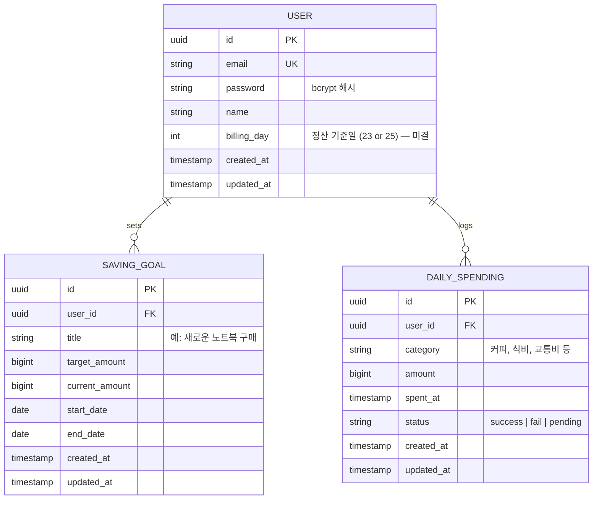

# erd.md — DB 스키마 (ERD)

> TypeORM으로 구현할 임시 DB 스키마. 추후 DB 조원 제공 스키마로 교체 예정.

## ERD (Mermaid)

## 테이블 상세 설명

### USER
| 컬럼 | 타입 | 제약 | 비고 |
|---|---|---|---|
| id | uuid | PK | `@PrimaryGeneratedColumn('uuid')` |
| email | varchar | UNIQUE, NOT NULL | 로그인 식별자 |
| password | varchar | NOT NULL | bcrypt 해시 저장 |
| name | varchar | NOT NULL | 사용자 표시명 |
| billing_day | int | NULL 가능 | 23 또는 25 (미결) |
| created_at | timestamptz | NOT NULL | 자동 생성 |
| updated_at | timestamptz | NOT NULL | 자동 갱신 |

### SAVING_GOAL
| 컬럼 | 타입 | 제약 | 비고 |
|---|---|---|---|
| id | uuid | PK | |
| user_id | uuid | FK → USER.id | |
| title | varchar | NOT NULL | 목표 이름 |
| target_amount | bigint | NOT NULL | 목표 금액 (원) |
| current_amount | bigint | DEFAULT 0 | 현재 누적 절약액 |
| start_date | date | NOT NULL | |
| end_date | date | NOT NULL | |
| created_at | timestamptz | NOT NULL | |
| updated_at | timestamptz | NOT NULL | |

### DAILY_SPENDING
| 컬럼 | 타입 | 제약 | 비고 |
|---|---|---|---|
| id | uuid | PK | |
| user_id | uuid | FK → USER.id | |
| category | varchar | NOT NULL | 커피/식비/교통비 등 |
| amount | bigint | NOT NULL | 소비 금액 (원) |
| spent_at | timestamptz | NOT NULL | 실제 소비 시각 |
| status | enum | NOT NULL | success / fail / pending |
| created_at | timestamptz | NOT NULL | |
| updated_at | timestamptz | NOT NULL | |

## 미결 사항
- `USER.billing_day`: 사용자별 설정 vs 글로벌 설정 여부 확인 필요
- `DAILY_SPENDING.status`: 레코드 단위인지, 날짜 단위인지 확인 필요
- `SAVING_GOAL.current_amount`: 직접 입력 vs 절약 성공일 자동 누적 방식 확인 필요
